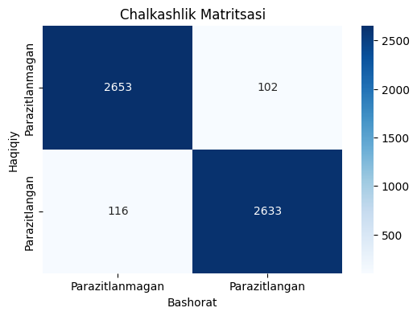
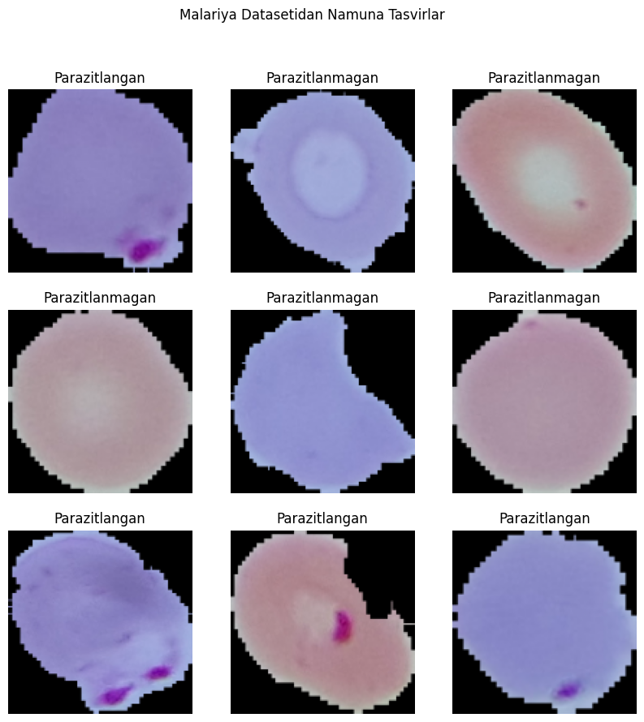
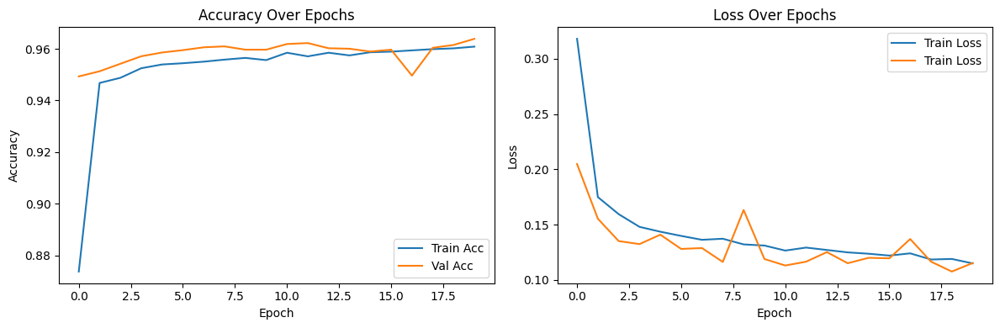

# Malaria Cell Image Classification using TensorFlow & Keras

This project implements a Convolutional Neural Network (CNN) using **TensorFlow** and its Keras API to classify malaria-infected cells from uninfected cells based on microscopic blood smear images. The goal is to develop an accurate model for automated malaria detection.

## Table of Contents
- [Project Objective](#project-objective)
- [Dataset](#dataset)
- [Technologies Used](#technologies-used)
- [Project Structure](#project-structure)
- [Features](#features)
- [Setup and Installation](#setup-and-installation)
- [Usage](#usage)
  - [Training the Model](#training-the-model)
  - [Running the FastAPI Server (Optional)](#running-the-fastapi-server-optional)
- [Results & Visualizations](#results--visualizations)
- [Ethical Considerations & Responsible AI](#ethical-considerations--responsible-ai)
- [BTEC Assignment Context (Optional)](#btec-assignment-context-optional)
- [Author](#author)

---
## Project Objective
The primary objective of this project is to build, train, and evaluate a deep learning model capable of accurately distinguishing between parasitized (malaria-infected) and uninfected red blood cells from microscopic images. This aims to provide a tool that could potentially aid in rapid and accessible malaria diagnosis.

---
## Dataset
The project utilizes the "cell\_images" dataset, which is a publicly available dataset containing images of segmented red blood cells. These images are categorized into:
* **Parasitized**: Cells infected with the malaria parasite.
* **Uninfected**: Healthy red blood cells.

The dataset is crucial for training and evaluating the CNN model. It's typically sourced from the NIH (National Institutes of Health) and can be found on platforms like Kaggle.

---
## Technologies Used
* **Programming Language**: Python 3.x
* **Deep Learning Framework**: TensorFlow 2.x (with Keras API)
* **Core Libraries**:
    * `tensorflow` (for model definition, training, evaluation)
    * `opencv-python` (cv2 - for image loading and resizing)
    * `numpy` (for numerical operations)
    * `matplotlib`, `seaborn` (for plotting and data visualization)
    * `scikit-learn` (for data splitting, confusion matrix, classification report)
* **Deployment (Optional, if applicable)**: FastAPI, Uvicorn
* **Frontend (Optional, if applicable)**: HTML, CSS, JavaScript

---
## Project Structure
The project follows a standard structure:

*(Please adjust the file and folder names above to exactly match your repository structure.)*

---
## Features
* **Custom CNN Model**: A Convolutional Neural Network architecture built using `tensorflow.keras.models.Sequential`.
* **Data Preprocessing**: Includes image resizing to a uniform size (e.g., 128x128) and normalization of pixel values.
* **Batch Generation**: A custom `batch_generator` function to efficiently load and feed data to the model in batches, conserving memory.
* **Data Augmentation**: On-the-fly data augmentation for the training set using `tensorflow.keras.preprocessing.image.ImageDataGenerator` (includes rotations, zooms, flips) to improve model generalization and prevent overfitting.
* **Model Training**: Leverages Keras's `model.fit()` method with data generators, including validation and callbacks like `EarlyStopping` for optimized training.
* **Comprehensive Model Evaluation**:
    * Quantitative metrics: Accuracy, Loss, Precision, Recall, F1-Score.
    * Visualizations: Confusion Matrix, Classification Report, Training/Validation Accuracy & Loss plots.
* **Feature Map Visualization**: (If implemented) Functionality to visualize activations from the initial convolutional layers to understand learned features.

---
## Setup and Installation

1.  **Prerequisites**:
    * Python (version 3.7 - 3.9 recommended for TensorFlow compatibility)
    * `pip` package installer

2.  **Clone the Repository**:
    ```bash
    git clone [https://github.com/UlashovaZaxro/Malaria-tensorflow.git](https://github.com/UlashovaZaxro/Malaria-tensorflow.git)
    cd Malaria-tensorflow
    ```

3.  **Create and Activate a Virtual Environment** (highly recommended):
    ```bash
    python -m venv .venv 
    # On Windows
    .venv\Scripts\activate
    # On macOS/Linux
    source .venv/bin/activate
    ```

4.  **Install Dependencies**:
    ```bash
    pip install -r requirements.txt
    ```
    *(Ensure your `requirements.txt` is up-to-date with all necessary packages like `tensorflow`, `opencv-python`, `numpy`, `matplotlib`, `seaborn`, `scikit-learn`.)*

5.  **Download Dataset**:
    * Ensure the `cell_images` dataset is present in the project's root directory or update the `data_dir` variable in your scripts/notebooks to point to its correct location.

---
## Usage

### Training the Model
1.  Execute your main Python script (e.g., `main.py` if it contains the training logic) or run the cells in your Jupyter Notebook (e.g., `tensorflow_malaria.ipynb`).
    ```bash
    python main.py 
    # or run the Jupyter Notebook
    ```
2.  The script/notebook will typically perform the following steps:
    * Load image paths and labels from the `cell_images` directory.
    * Split the data into training, validation, and test sets.
    * Initialize data generators for feeding data to the model.
    * Define the CNN model architecture using Keras.
    * Compile the model (specifying optimizer, loss function, and metrics).
    * Train the model using `model.fit()` with the training and validation generators.
    * Evaluate the trained model on the test set.
    * Display and/or save performance metrics and visualizations.
3.  The trained model might be saved to a file (e.g., `malaria_model_tf.h5` or in TensorFlow's SavedModel format).

### Running the FastAPI Server (Optional)
If your `main.py` (or a separate script like `hello.py` if it's for deployment) implements a FastAPI application to serve your trained model:
1.  Ensure your trained TensorFlow model file (e.g., `malaria_model_tf.h5`) is available and its path is correctly referenced in your FastAPI script.
2.  Start the Uvicorn server:
    ```bash
    uvicorn main:app --reload 
    ```
    *(Replace `main:app` with `your_fastapi_script_name:your_fastapi_app_instance` if different. Remove `--reload` for production.)*
3.  The API should now be accessible (typically at `http://127.0.0.1:8000`). You can check the auto-generated documentation at `http://127.0.0.1:8000/docs`.
4.  If you have an `index.html` in a `templates` folder configured to interact with this API, you can open it in your browser.

---
## Results & Visualizations 📊

The TensorFlow/Keras CNN model developed in this project achieved an accuracy of approximately **[Your TensorFlow Model's Test Accuracy, e.g., 96.1%]** on the test set. Detailed performance metrics (Precision, Recall, F1-score) and visualizations are generated by the script/notebook.

Below are some key visualizations from the model training and evaluation:

### Confusion Matrix
This confusion matrix details the classification performance of the TensorFlow model on the test set, showing True Positives, True Negatives, False Positives, and False Negatives for 'Parasitized' and 'Uninfected' classes.

*Caption: Confusion matrix for the TensorFlow model on the test dataset.*

### Training History
The following plots illustrate the model's accuracy and loss progression over epochs for both the training and validation datasets during the TensorFlow model training.
*(Please save your training history plot (image_857e6d.png) as `training_history_tf.png` in the `images` folder for this link to work).*

*Caption: Accuracy and Loss curves over 20 epochs for training and validation phases.*

### Sample Images from Dataset
These are examples of 'Parasitized' and 'Uninfected' cell images from the dataset used for training the TensorFlow model.
*(Assuming `example.png` in your `images` folder (from image_857e92.png) is the display of sample images (like image_857e4f.png)).*

*Caption: Examples of malaria-infected and uninfected cell images from the dataset.*

### Project-Specific Diagram (Optional)
*(Your `images` folder contains a `diagram.png`. Describe and display it here if relevant, e.g., model architecture, workflow.)*

*Caption: [Please describe what `diagram.png` illustrates, e.g., "CNN Model Architecture Diagram" or "Project Workflow"].*

---
## Ethical Considerations & Responsible AI
Developing AI for medical image analysis, like this malaria detection model, requires careful consideration of ethical responsibilities. Key aspects include:
* **Patient Safety**: Prioritizing model accuracy and robustness to minimize the risk of misdiagnosis.
* **Fairness & Bias**: Ensuring the `cell_images` dataset is representative and the model performs equitably across different demographics to prevent biased outcomes.
* **Transparency & Explainability**: Working towards making model decisions understandable to clinicians and, where appropriate, patients.
* **Data Privacy & Security**: Protecting the sensitive nature of medical image data (`cell_images`) and the integrity of the model (`malaria_model_tf.h5`).
* **Human Oversight**: Emphasizing that this AI model is intended as a tool to assist medical professionals, not to replace their expertise and final judgment.

These considerations are crucial for the responsible development and deployment of AI in healthcare.

---
## BTEC Assignment Context (Optional)
*(If this project is for your BTEC assignment, you can briefly mention it here, similar to the PyTorch README, referencing the Unit and Learning Outcomes covered.)*

Example:
This project was developed as part of the Pearson BTEC Level 4 Higher National Certificate in Digital Technologies, Unit 15: Fundamentals of Artificial Intelligence (AI) and Intelligent Systems. It addresses key learning outcomes and criteria related to AI model development, evaluation, ethical considerations, and deployment strategies.

---
## Author
* **Ulashova Zaxro**
    * GitHub: [UlashovaZaxro](https://github.com/UlashovaZaxro)
